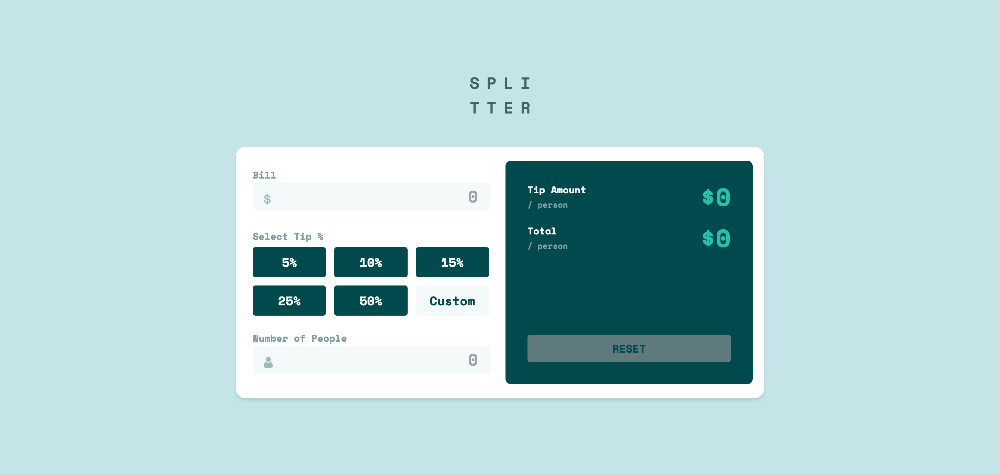

# Test task for datarockets

This is a solution to the [Tip calculator app challenge on Frontend Mentor](https://www.frontendmentor.io/challenges/tip-calculator-app-ugJNGbJUX).

## Table of contents

- [Overview](#overview)
  - [The challenge](#the-challenge)
  - [Screenshot](#screenshot)
- [Manual installation](#manual-installation)
  - [Built with](#built-with)
- [Author](#author)

## Overview

### The challenge

Users should be able to:

- View the optimal layout for the app depending on their device's screen size
- See hover states for all interactive elements on the page
- Calculate the correct tip and total cost of the bill per person

### Screenshot



### Links

- Live Site URL: [Open](https://data-rockets-test-task.vercel.app/)

## Manual installation

- with pnpm 
``` 
    pnpm i
    pnpm dev
``` 
- visit [preview](http:localhost:5173)
### Built with

- Semantic HTML5 markup
- CSS (TailwindCSS)
- Flexbox
- CSS Grid
- Mobile-first workflow
- [React](https://reactjs.org/) - JS library

## Author

- Bekhruz Bakhodirov - [Github profile](https://github.com/dontmeway)
- bbakhadyrov@gmail.com
- Telegram - [@dontmeway](dontmeway.t.me)

